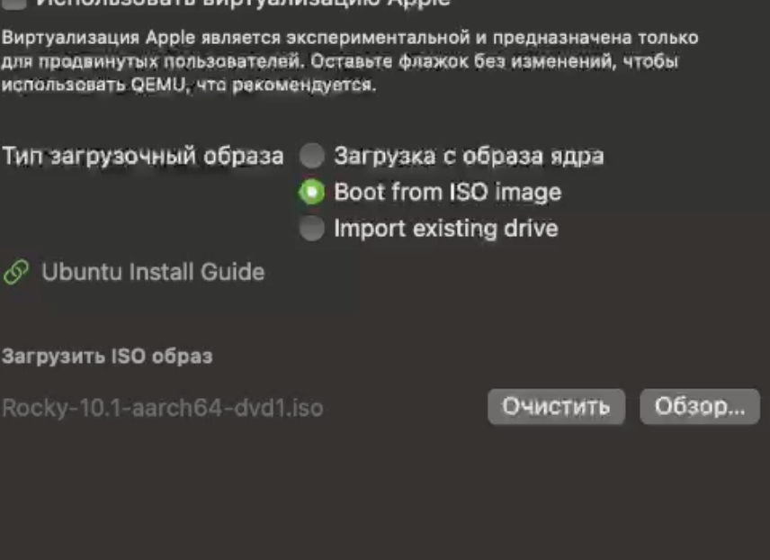
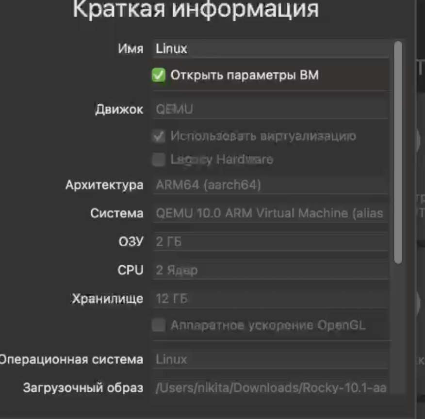
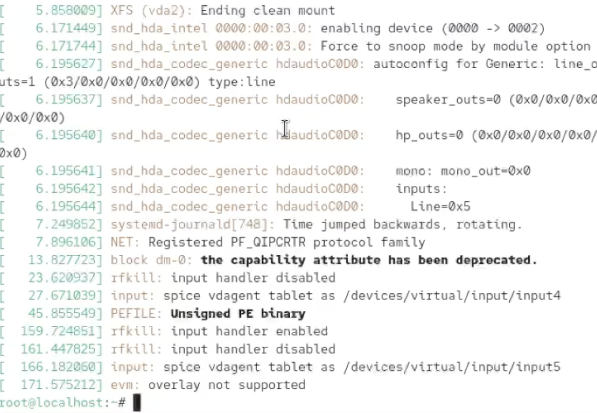
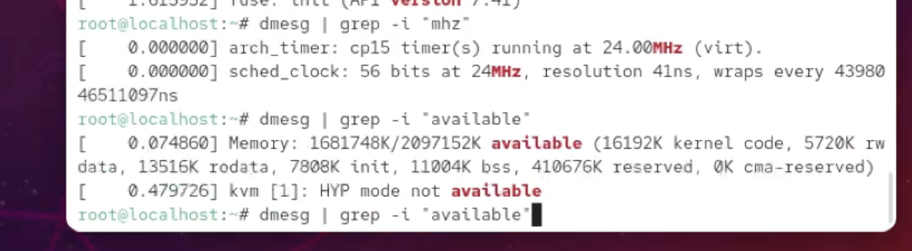

---
## Front matter
lang: ru-RU
title: Отчёт по выполнению лабораторной работы №1
subtitle: Работа с группами
author:
  - Коровкин Н. М.
institute:
  - Российский университет дружбы народов, Москва, Россия
date: 16 феврался 2026

## i18n babel
babel-lang: russian
babel-otherlangs: english

## Formatting pdf
toc: false
toc-title: Содержание
slide_level: 2
aspectratio: 169
section-titles: true
theme: metropolis
header-includes:
 - \metroset{progressbar=frametitle,sectionpage=progressbar,numbering=fraction}
 - '\makeatletter'
 - '\beamer@ignorenonframefalse'
 - '\makeatother'
 
## Fonts
mainfont: PT Serif
romanfont: PT Serif
sansfont: PT Sans
monofont: PT Mono
mainfontoptions: Ligatures=TeX
romanfontoptions: Ligatures=TeX
sansfontoptions: Ligatures=TeX,Scale=MatchLowercase
monofontoptions: Scale=MatchLowercase,Scale=0.9
---

# Информация

## Докладчик

:::::::::::::: {.columns align=center}
::: {.column width="70%"}

  * Коровкин Никита Михайлович
  * Студент
  * Российский университет дружбы народов
  * [1132246835@pfur.ru](mailto:1132246835@pfur.ru)

:::
::: {.column width="30%"}

:::
::::::::::::::

## Цель работы

Целью данной работы является приобретение практических навыков
установки операционной системы на виртуальную машину, настройки минимально необходимых для дальнейшей работы сервисов.

## Задание

1. Установить операционную систему linux rocky

## Выполнение лабораторной работы

Первым делом мы создаем новую виртуальную машину. На этом этапе необходимо присвоить ей уникальное имя и выбрать ISO-образ с дистрибутивом Rocky Linux, который будет использоваться как загрузочный диск.(рис. [-@fig:001]).

{#fig:01 width=70%}

## Выполнение лабораторной работы

Для обеспечения стабильной работы системы зададим следующие параметры аппаратного обеспечения:

* **Оперативная память:**  (2 ГБ)
* **Процессор:** 2 ядра

Следующим шагом создаем виртуальный накопитель. Для нужд системы и будущего ПО выделяем **42 ГБ** дискового пространства.(рис. [-@fig:002]).

{#fig:02 width=70%}

## Выполнение лабораторной работы
После запуска виртуальной машины переходим к инсталлятору.Выбираем язык(рис. [-@fig:003]).

{#fig:03 width=70%}

## Выполнение лабораторной работы

Создаем рут пользователя(рис. [-@fig:004]).

{#fig:04 width=70%}

В меню выбора ПО выбираем вариант **«Server with GUI»** (Сервер с графическим интерфейсом) и обязательно отмечаем аддон **«Development Tools»** для возможности компиляции софта.

## Выполнение лабораторной работы
* **Разметка:** Выбираем ранее созданный виртуальный диск для установки системных разделов.
* **Сеть:** Активируем сетевой интерфейс в разделе Network, чтобы система получила доступ к интернету сразу после загрузки.
(рис. [-@fig:005]).

{#fig:05 width=70%}

## Выполнение лабораторной работы
Для проверки корректности инициализации оборудования воспользуемся утилитой `dmesg`.(рис. [-@fig:006]).

{#fig:06 width=70%}

## Выполнение лабораторной работы
* **Ядро:** Проверяем версию запущенного ядра Linux.(рис. [-@fig:007]).

{#fig:07 width=70%}

## Выполнение лабораторной работы
* **Аппаратные данные:** С помощью фильтров в логах dmesg анализируем частоту и модель процессора(рис. [-@fig:008]).

{#fig:08 width=70%}

## Выполнение лабораторной работы
объем доступной RAM, тип используемого гипервизора, а также порядок монтирования файловых систем.(рис. [-@fig:009]).

{#fig:09 width=70%}

## Ответ на контрольные вопросы

 1. Какую информацию содержит учётная запись пользователя?

Учётная запись (хранится в файле `/etc/passwd`) включает:

* **Имя пользователя** (login name).
* **Идентификатор пользователя (UID)** и **группы (GID)**.
* **Домашний каталог** (путь к личной папке).
* **Командную оболочку** (shell, например, `/bin/bash`).
* **Полное имя** или комментарий (GECOS).
* **Пароль** (в зашифрованном виде хранится в `/etc/shadow`).

 2. Команды терминала

* **Справка:** `man` или `--help`.
* *Пример:* `man ls` или `cp --help`

* **Перемещение:** `cd` (change directory).
* *Пример:* `cd /var/log`

* **Просмотр содержимого:** `ls` (list).
* *Пример:* `ls -la` (показать всё, включая скрытые файлы)

* **Объём каталога:** `du` (disk usage).
* *Пример:* `du -sh /home/user` (в человекочитаемом виде)

* **Создание/удаление:**
* *Создать папку:* `mkdir folder_name`
* *Создать файл:* `touch file.txt`
* *Удалить файл:* `rm file.txt`
* *Удалить папку:* `rm -r folder_name`

* **Права доступа:** `chmod` (change mode).
* *Пример:* `chmod 755 script.sh` (rwxr-xr-x)

* **История команд:** `history`.
* *Пример:* `history 10` (показать последние 10 команд)

 3. Что такое файловая система?

**Файловая система (ФС)** — это порядок, определяющий способ организации, хранения и именования данных на носителе. Она связывает данные на диске с тем, что видит пользователь.

**Примеры:**

* **Ext4:** Основная ФС для Linux. Журналируемая, надежная и быстрая.
* **NTFS:** Стандарт для Windows. Поддерживает большие файлы и сложные права доступа.
* **FAT32/exFAT:** Универсальные ФС для флешек. Имеют высокую совместимость, но FAT32 ограничена файлами до 4 ГБ.
* **Btrfs:** Современная ФС с поддержкой снимков (snapshots) и объединения дисков.

 4. Как посмотреть, какие файловые системы установлены?

Для просмотра смонтированных файловых систем и их типов используются следующие команды:

* `df -T` — показывает список смонтированных разделов, их тип и заполненность.
* `lsblk -f` — выводит древовидный список блоков (дисков) с указанием их ФС.
* `mount` — выводит детальную информацию о всех подключенных ресурсах.

---

## Выводы

В ходе выполнения работы была успешно создана и настроена виртуальная машина в среде **UTM**. Операционная система Rocky Linux развернута с необходимым набором инструментов разработчика и оптимизирована для работы в виртуальной среде.

## Список литературы{.unnumbered}

::: {#refs}
:::
